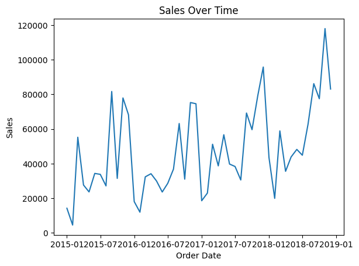
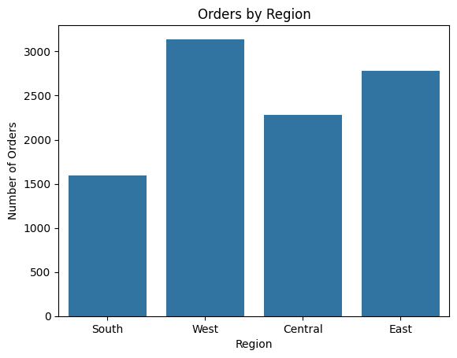
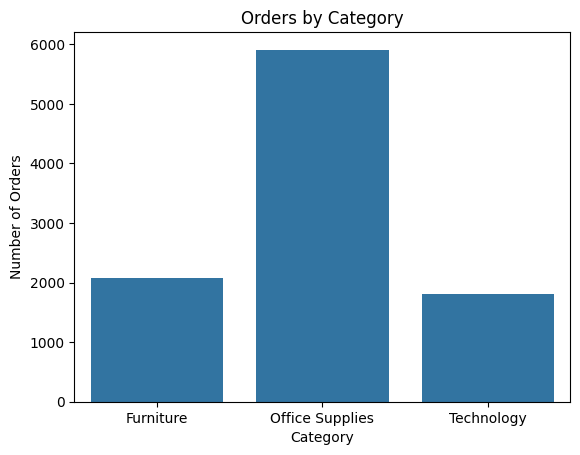
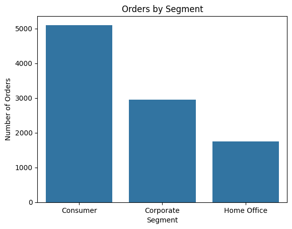

# **EDA** Superstore Sales Dataset 

## Workflow
1. Load dataset into Python using Jupyter Notebook
    - Allows interactive programming, seeing the results of input commands immediately
2. Perform data cleaning and exploration
3. Create a few simple visualizations for initial analysis prior to loading into Tableau for full analysis


```python
# Loading necessary libraries for cleaning and analysis

import numpy as np  # Fundamental for numerical operations
import pandas as pd  # Essential for manipulating and analyzing large dataframes
import matplotlib.pyplot as plt  # Allows creation of data visualizations in Python
import seaborn as sns  # Allows creation of data visualizations in Python as well, usually requiring less code


df = pd.read_csv("datasets/train.csv", index_col=[0])  # Laoding dataset from the downloaded csv file

print(df.head())  # Taking advantage of Jupyter Notebooks REPL(Read Evalute Print Loop) functionality for an overview of the data
```

                  Order ID  Order Date   Ship Date       Ship Mode Customer ID  \
    Row ID                                                                       
    1       CA-2017-152156  08/11/2017  11/11/2017    Second Class    CG-12520   
    2       CA-2017-152156  08/11/2017  11/11/2017    Second Class    CG-12520   
    3       CA-2017-138688  12/06/2017  16/06/2017    Second Class    DV-13045   
    4       US-2016-108966  11/10/2016  18/10/2016  Standard Class    SO-20335   
    5       US-2016-108966  11/10/2016  18/10/2016  Standard Class    SO-20335   
    
              Customer Name    Segment        Country             City  \
    Row ID                                                               
    1           Claire Gute   Consumer  United States        Henderson   
    2           Claire Gute   Consumer  United States        Henderson   
    3       Darrin Van Huff  Corporate  United States      Los Angeles   
    4        Sean O'Donnell   Consumer  United States  Fort Lauderdale   
    5        Sean O'Donnell   Consumer  United States  Fort Lauderdale   
    
                 State  Postal Code Region       Product ID         Category  \
    Row ID                                                                     
    1         Kentucky      42420.0  South  FUR-BO-10001798        Furniture   
    2         Kentucky      42420.0  South  FUR-CH-10000454        Furniture   
    3       California      90036.0   West  OFF-LA-10000240  Office Supplies   
    4          Florida      33311.0  South  FUR-TA-10000577        Furniture   
    5          Florida      33311.0  South  OFF-ST-10000760  Office Supplies   
    
           Sub-Category                                       Product Name  \
    Row ID                                                                   
    1         Bookcases                  Bush Somerset Collection Bookcase   
    2            Chairs  Hon Deluxe Fabric Upholstered Stacking Chairs,...   
    3            Labels  Self-Adhesive Address Labels for Typewriters b...   
    4            Tables      Bretford CR4500 Series Slim Rectangular Table   
    5           Storage                     Eldon Fold 'N Roll Cart System   
    
               Sales  
    Row ID            
    1       261.9600  
    2       731.9400  
    3        14.6200  
    4       957.5775  
    5        22.3680  
    

## Observations
1. What information is included in this dataset?
    - Unique identifiers for orders placed by each customer
    - Columns for both the date of the order and the date the order was shipped
    - How the order was shipped
    - Unique identifier for each customer
    - Each customer's name
    - Column representing various customer types
    - Geographic information for each order
    - Regional information for each order
    - Unique identifiers for each product ordered
    - Data for the name of the ordered product, what type of product it is, and what department of the store it belongs to
    - Total amount paid for the ordered product
3. What information needs to be checked for formatting errors or other concerns?
    - The **Order Date** and **Ship Date** columns are not formatted for the US
      * These columns currently display the date with the day first, followed by the month, then by the year
        * This will pose a problem when attempting to perform analysis, the dates will need to be converted to month/day/year instead

## Checking for missing values and datatype issues 
Calling for a ```DataFrame``` of all columns, showing their name, count of non-missing values, and datatype.


```python
print(df.info())  # Lists how the information in each column is currently formatted
```

    <class 'pandas.DataFrame'>
    RangeIndex: 9800 entries, 1 to 9800
    Data columns (total 17 columns):
     #   Column         Non-Null Count  Dtype  
    ---  ------         --------------  -----  
     0   Order ID       9800 non-null   str    
     1   Order Date     9800 non-null   str    
     2   Ship Date      9800 non-null   str    
     3   Ship Mode      9800 non-null   str    
     4   Customer ID    9800 non-null   str    
     5   Customer Name  9800 non-null   str    
     6   Segment        9800 non-null   str    
     7   Country        9800 non-null   str    
     8   City           9800 non-null   str    
     9   State          9800 non-null   str    
     10  Postal Code    9789 non-null   float64
     11  Region         9800 non-null   str    
     12  Product ID     9800 non-null   str    
     13  Category       9800 non-null   str    
     14  Sub-Category   9800 non-null   str    
     15  Product Name   9800 non-null   str    
     16  Sales          9800 non-null   float64
    dtypes: float64(2), str(15)
    memory usage: 1.3 MB
    None
    

## Obersvations
- Both **Order Date** and **Ship Date** are not currently formatted as dates, as previously assumed
- There are 11 rows of orders that do not include the postal code. This is found by observing the Non-Null Count. Since the postal code is not needed for sales analysis these NaN values will be ignored for now and removed later in my workflow 

## Change date format
Converting **Order Date** to format that will be recognized as date and time when performing analysis
- I am not converting the **Ship Date** column, as this data is not necessary for performing my sales analysis and will be removed from the dataset prior to export


```python
df['Order Date'] = pd.to_datetime(df['Order Date'], dayfirst=True)  # Tells Python data in this column should be recognized as a date and time value formatted with the day preceeding the month

print(df.dtypes)  # Verifying command was successful
```

    Order ID                    str
    Order Date       datetime64[us]
    Ship Date                   str
    Ship Mode                   str
    Customer ID                 str
    Customer Name               str
    Segment                     str
    Country                     str
    City                        str
    State                       str
    Postal Code             float64
    Region                      str
    Product ID                  str
    Category                    str
    Sub-Category                str
    Product Name                str
    Sales                   float64
    dtype: object
    

## Identifying unnecessary columns
1. **Customer Name** is not needed for sales analysis and also poses a potential PII concern and will therefore be removed
2. I have previously determined the **Postal Code** column will be removed
3. I have already determined **Postal Code** and **Ship Date** will be removed
4. **Ship Mode** will also not be necessary for sales analysis and will therefore be removed

## Removing unnecessary columns
Executing command to remove all columns I have determined to be unecessary or potentially harmful to analysis


```python
df.drop(['Customer Name', 'Postal Code', 'Ship Date', 'Ship Mode'], axis=1, inplace=True)  # Removing the listed columns from the dataset

print(df.head())  # Verifying command was successful
```

                  Order ID Order Date Customer ID    Segment        Country  \
    Row ID                                                                    
    1       CA-2017-152156 2017-11-08    CG-12520   Consumer  United States   
    2       CA-2017-152156 2017-11-08    CG-12520   Consumer  United States   
    3       CA-2017-138688 2017-06-12    DV-13045  Corporate  United States   
    4       US-2016-108966 2016-10-11    SO-20335   Consumer  United States   
    5       US-2016-108966 2016-10-11    SO-20335   Consumer  United States   
    
                       City       State Region       Product ID         Category  \
    Row ID                                                                         
    1             Henderson    Kentucky  South  FUR-BO-10001798        Furniture   
    2             Henderson    Kentucky  South  FUR-CH-10000454        Furniture   
    3           Los Angeles  California   West  OFF-LA-10000240  Office Supplies   
    4       Fort Lauderdale     Florida  South  FUR-TA-10000577        Furniture   
    5       Fort Lauderdale     Florida  South  OFF-ST-10000760  Office Supplies   
    
           Sub-Category                                       Product Name  \
    Row ID                                                                   
    1         Bookcases                  Bush Somerset Collection Bookcase   
    2            Chairs  Hon Deluxe Fabric Upholstered Stacking Chairs,...   
    3            Labels  Self-Adhesive Address Labels for Typewriters b...   
    4            Tables      Bretford CR4500 Series Slim Rectangular Table   
    5           Storage                     Eldon Fold 'N Roll Cart System   
    
               Sales  
    Row ID            
    1       261.9600  
    2       731.9400  
    3        14.6200  
    4       957.5775  
    5        22.3680  
    

## Checking for and removing duplicates
The following commands first check for the total number of duplicate rows. The second command will remove those duplicates


```python
print(df.duplicated().sum())  # Finds rows where each column contains a duplicate entry of another column
```

    1
    


```python
df.drop_duplicates(keep='first', inplace=True)  # Removes all duplicate rows, leaving the first occurance of the row
```

## Verifying no negative **Sales** values
This step will identify if any orders may have been returns.


```python
print((df['Sales'] < 0).sum())  # Locates any values within the Sales column that are less than 0 and returns the total found
```

    0
    

## Removing any potential leading/trailing whitespace from ```str``` values
Utilizing regular expressions to remove any unseen spaces preceeding or following any text within the dataframe. These unseen spaces can negatively impact analysis if not found and removed.


```python
df = df.replace(r'^ +| +$', r'', regex=True)  # Replaces any empty space preceding or trailing text with nothing, thus removing the empty spaces
```

## Quick exploration
Now that the data has been cleaned I will quickly explore and visualize what the data is telling us, prior to completing full analysis in Tableau.


```python
print(df.describe())  # Quick statistical summary of the data
```

                           Order Date         Sales
    count                        9799   9799.000000
    mean   2017-05-01 07:02:29.525461    230.763895
    min           2015-01-03 00:00:00      0.444000
    25%           2016-05-24 12:00:00     17.248000
    50%           2017-06-26 00:00:00     54.480000
    75%           2018-05-15 00:00:00    210.572000
    max           2018-12-30 00:00:00  22638.480000
    std                           NaN    626.683644
    


```python
print(df['Region'].value_counts())  # Quick summary of sales by region
```

    Region
    West       3140
    East       2784
    Central    2277
    South      1598
    Name: count, dtype: int64
    


```python
print(df['Category'].value_counts())  # Quick summary of sales by category
```

    Category
    Office Supplies    5909
    Furniture          2077
    Technology         1813
    Name: count, dtype: int64
    


```python
print(df['Segment'].value_counts())  # Quick summary of sales by customer segment
```

    Segment
    Consumer       5101
    Corporate      2953
    Home Office    1745
    Name: count, dtype: int64
    

## Observations
- Sales have generally increased over time
  * 2015 has the lowest sales and 2018 has the highest sales
- The West region has the highest volume of orders
- Office Supplies has the hightest volume of orders
- Consumers have placed the most orders

## Quick visualizations
Creating some quick visualizations to further display my findings.

## Sales Over Time
Line graph to further show an increase in sales as time has passed.


```python
df_monthly = df.resample('MS', on='Order Date').sum()  # Aggregates sales by month for easier readability

sns.lineplot(x=df_monthly.index, y='Sales', data=df_monthly)
plt.title('Sales Over Time')
plt.show()
```


    

    


## Orders by Region
Bar graph to further show the region with the highest number of orders.


```python
sns.countplot(x='Region', data=df)
plt.title('Orders by Region')
plt.xlabel('Region')
plt.ylabel('Number of Orders')
plt.show()
```


    

    


## Orders by Category
Bar graph to further show the category with the highest number of orders.


```python
sns.countplot(x='Category', data=df)
plt.title('Orders by Category')
plt.xlabel('Category')
plt.ylabel('Number of Orders')
plt.show()
```


    

    


## Orders by Segment
Bar graph to further show the segment with the highest number of orders.


```python
sns.countplot(x='Segment', data=df)
plt.title('Orders by Segment')
plt.xlabel('Segment')
plt.ylabel('Number of Orders')
plt.show()
```


    

    


## Exporting clean data to new *csv*


```python
# Saving cleaned data to a new csv file for further analysis in Tableau

try:
    df.to_csv('datasets/train_cleaned.csv')
except FileNotFoundError:
    print("The path does not exist.")
except PermissionError:
    print("Permission denied for the file.")
except Exception as e:
    print(f"An error occurred: {e}")
else:
    print("File saved successfully.")
```

    File saved successfully.
    
